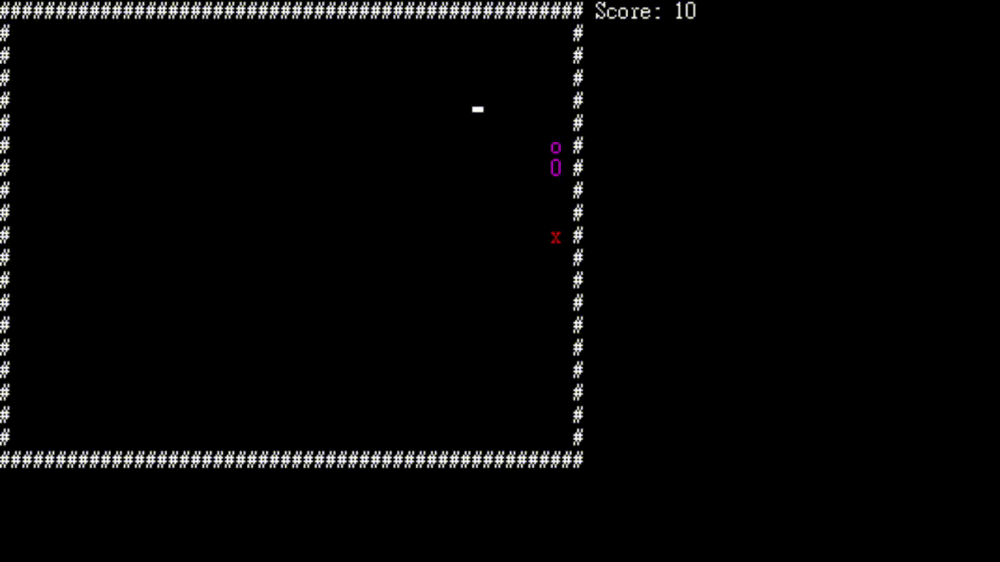

## Snake Game
This is the terminal project of the course "Speech Compression" in my college.
((( my English is not good, sorry...

[Demo Video](https://youtu.be/q1S-aw7Jgzg)

### README.md Language
- [English](/README.md)
- [Tranditional Chinese](/README.zh-tw.md)

### Dev. Motivation
Although this is the terminal project of the course "Speech Compression", I thought that the teacher taught the the operation of command prompt with C/C++ and the use of **Portaudio + Libsndfile library**. It let me think of **"Command Prompt"** and **"Music"**. I have enthusiasm for game, and I was impressed with command prompt game in my childhood. So I want to develop a command prompt console game. Originally, I want to develop a big game, but there isn't enough time.

### Features 
- Just a simple snake game.
- With simple BGM and SFX in game.
  - using Portaudio + Libsndfile library
- When game over, you can restart or exit the game

### Structure Chart

### Gameplay & User Interface
Using arrow keys of keyboard to control.
When eating symbol "x", the score will +10.
You can press any key to restart or press ESC to exit after game over.

### External Library
- [Portaudio](https://github.com/PortAudio/portaudio)
- [LibSndfile](https://github.com/libsndfile/libsndfile)

### Music & Audio source
（Non-profit. I only for learning purposes.）
- BGM – YOASOBI「夜に駆ける」8bit-Remix
  - https://www.youtube.com/watch?v=sHsqavJpBNU&t
- Game Over Audio – Game Over (8-Bit Music)
  - https://youtu.be/br3OzOrARh4
- Coin Audio – 8-Bit Coin – Sound Effect – Copyright Free
  - only fetch first 1 second
  - https://www.youtube.com/watch?v=Wp5oAY6feDY
