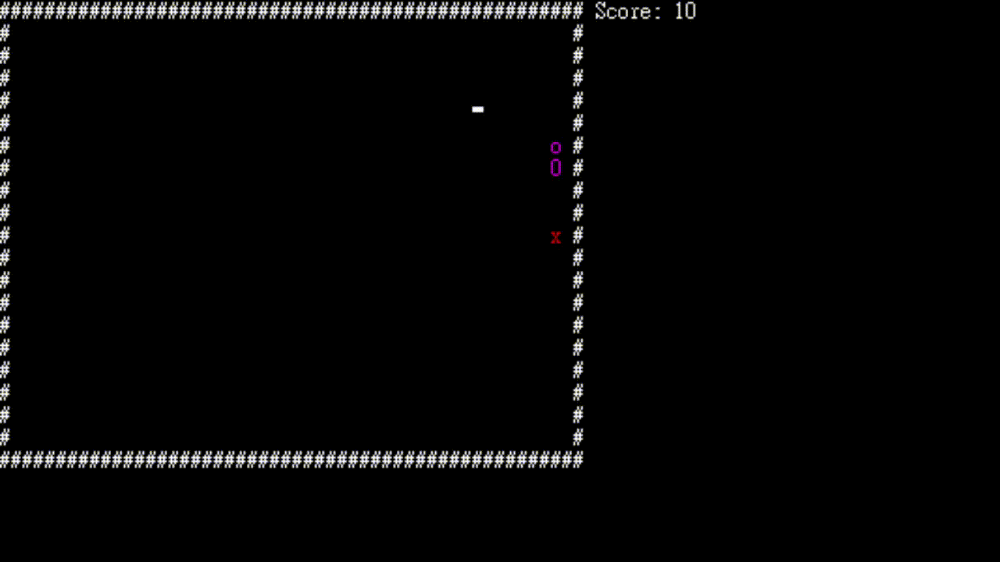
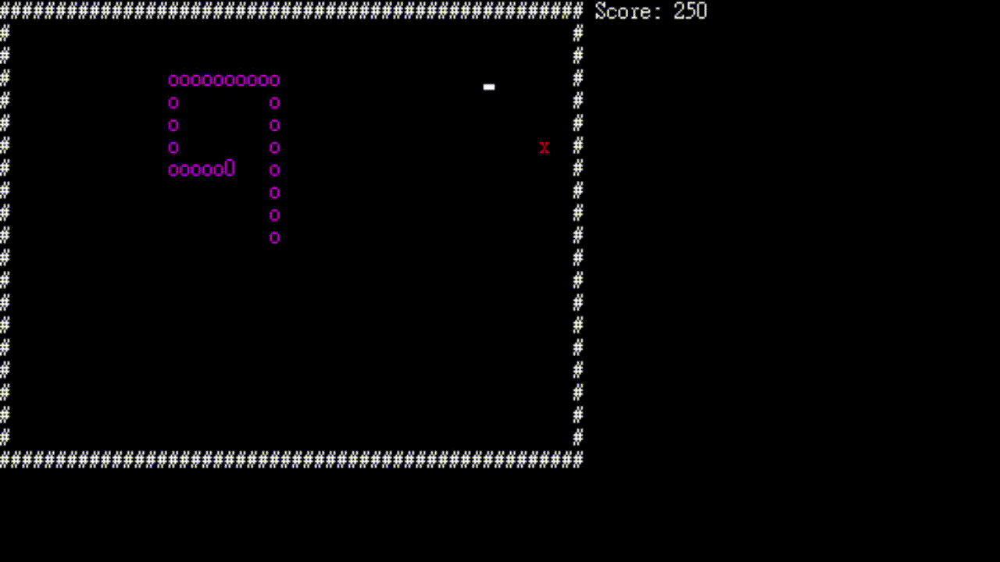

## 貪食蛇
此為大學課程「語音壓縮」之期末專題

### README.md Language
- [English](/README.md)
- [Tranditional Chinese](/README.zh-tw.md)

### 開發動機
雖然是語音壓縮，但我想到老師教過終端機的操作及 **PortAudio + Libsndfile 函式庫**的使用，讓我想到 **終端機** + **音樂**。且自身對遊戲很有熱誠，加上小時候對於終端機遊戲的印象深刻，因此決定從終端機遊戲下手。不過原本想做大型一些的遊戲，但礙於我時間有限，因此決定僅做小小的遊戲就好。

### 功能說明
- 其實就是很簡單的貪食蛇小遊戲
- 在遊玩時會有 BGM 及音效播放
  - 使用 Portaudio + Libsndfile library
- 當GameOver後，可以重新開始或結束遊戲

### 程式架構圖

### 操作說明 & 使用者介面
鍵盤之上下左右控制，吃到 x 分數 +10。
Gameover後，按下任意鍵重新開始遊戲，按ESC可離開遊戲。

### 使用的外部函式庫
- [Portaudio](https://github.com/PortAudio/portaudio)
- [LibSndfile](https://github.com/libsndfile/libsndfile)

### 素材來源
（無營利，僅做學習用途）
- BGM – YOASOBI「夜に駆ける」8bit-Remix
  - https://www.youtube.com/watch?v=sHsqavJpBNU&t
- Game Over Audio – Game Over (8-Bit Music)
  - https://youtu.be/br3OzOrARh4
- Coin Audio – 8-Bit Coin – Sound Effect – Copyright Free（僅取前1秒）
  - https://www.youtube.com/watch?v=Wp5oAY6feDY
